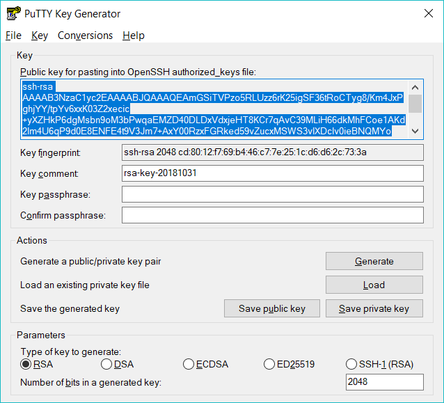
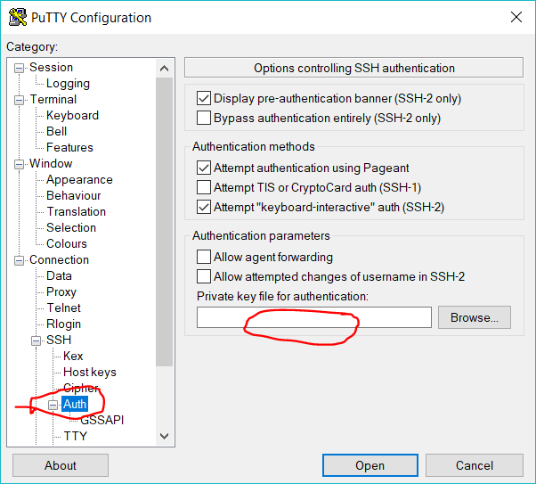
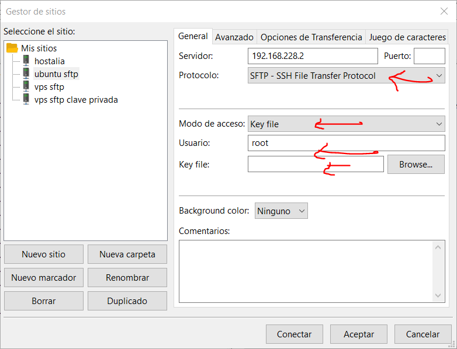

## Generar claves.
### En putty
Es necesario generar una pareja de claves: pública y privada.
Utilizando [puttygen](https://www.chiark.greenend.org.uk/~sgtatham/putty/latest.html), el generador de claves de putty:

1. Escoger algoritmo criptográfico con **type of key**. RSA es la más utilizada. Se puede escoger el tamaño de la clave. (512, 1024, 2048, 4096)
2. Generar clave con el botón **generate**. Se capturan datos aleatorios moviendo el ratón
3. Guardar la clave privada, con **save private key**. Se recomienda encarecidamente proteger las claves privadas con una contraseña: fíjala antes de guardar en **Key passhphrase**. Esa contraseña se te pedirá cada vez que utilices tu clave privada. Los ficheros de claves privadas de putty tienen extensión .ppk
4. _OPCIONAL_ Guarda tu clave pública en un fichero.
5. Hay que llevar la clave pública al servicio OpenSSH. En el VPS, se copia la clave pública en el formato especificado en el cuadro **Public key for pasting into OpenSSH authorized_keys file** en un fichero de texto llamado **.ssh/authorized_keys** en el _home_ del usuario que vaya a acceder. Si no existiese la carpeta .shh o el fichero, se crean.

### En linux
Al igual que con putty, la generación de claves se hace en tu máquina de desarrollo, no en el VPS. 

Generar claves:
```	
ssh-keygen -t rsa
```

A continuación, tendrás que escribir la ubicación del archivo en el que desea guardar la clave privada:
```	
Enter file in which to save the key (/home/youruser/.ssh/id_rsa):
```

La key pública se guardará en la misma ubicación, con el mismo nombre de archivo, pero con la extensión .pub. No escribas nada para usar la ubicación predeterminada, que es /home/youruser/.ssh/id_rsa.

Por último, tendrás que escribir una contraseña. Esta será la contraseña requerida para cargar la key privada y usarla para conectarse a través de SSH más adelante:
```	
Enter passphrase (empty for no passphrase):
``` 

El proceso completo debería ser el siguiente:
```
user@localhost: ssh-keygen -t rsa
Generating public/private rsa key pair.
Enter file in which to save the key (/home/youruser/.ssh/id_rsa):
Enter passphrase (empty for no passphrase):
Enter same passphrase again:
Your identification has been saved in id_rsa.
Your public key has been saved in id_rsa.pub.
The key fingerprint is:
16:8e:e8:f2:1d:c9:b9:cf:43:9a:b3:3c:c1:1f:95:93 user@localhost
```
Esto creará una clave privada escrita en /home/user/.ssh/id_dsa y una clave pública escrita en /home/user/.ssh/id_dsa.pub. El passphrase se usa para proteger tu clave. Se te pedirá cuando te conectes por SSH.

la clave pública debe añadirse al fichero **.ssh/authorized_keys** en el VPS

## Usar claves
### En putty:


### En filezilla
Usando el gestor de sitios, no la conexión rápida.


## Forzar uso de claves
Al incluir lo siguiente en el fichero de configuración de OpenSSH sólo se permite el acceso con claves, y no con contraseña
```
PasswordAuthentication no
```

