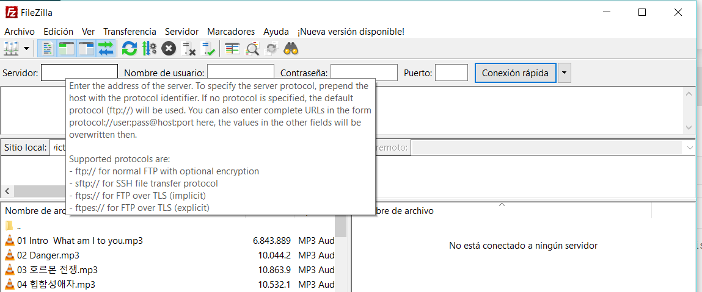

El protocolo SSH puede utilizarse para la transferencia de ficheros, mediante una extensión del mismo conocida como **SSH File Transfer Protocol**, o **SFTP** (No confundir con FTP sobre SSL, comúnmente abreviado como **FTPS**)

>>>> <big>No es un estárdar de Internet. Se basa en un proyecto caducado del IETF. </big>  
>>>> Es popular porque OpenSSH implementa esta extensión, y Filezilla client permite utilizarla facilmente.  
>>>> No se recomienda especialmente para entornos en producción, porque puede presentar posibles problemas no previstos.

Para una conexión rápida por _sftp_ en filezilla basta indicar el protocolo en la caja.
