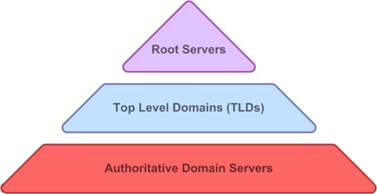

[TOC]
## Descripcion
Por comodidad, asignamos nombres a los ordenadores para no tener que recordar direcciones de red.
En el sistema actual, cada vez que una aplicación solicita la apertura de un transporte, lo hace a través del sistema operativo. El sistema operativo requerirá la dirección del programa hacia el que se quiere abrir el transporte: una dirección IP + un puerto.

No obstante, si en lugar de una dirección IP se proporciona un nombre, el sistema operativo, previamente intentará resolver el nombre.
Resolver un nombre de ordenador consiste en obtener la IP asociada a ese nombre,

* Significado: Domain Name Server
* Nivel: aplicación
* Puerto: **53 UDP**, (y 53 TPC para algunas acciones de DNS)
* Versión actual: Sin numerar: Año 1987. Estándar IETF [RFC1034](https://tools.ietf.org/html/rfc1035) [RFC1034](https://tools.ietf.org/html/rfc1035). 
* Versión preliminar de 1983 por _Paul V. Mockapetris_.
 (Paul V. Mockapetris, Massachusetts EEUU, 1948) 

Los nombres que ponemos a los ordenadores pueden tener carácter:
* **Privado**: cuando se utilizan en el ámbito de una red local. No es necesario tener ninguna precaución, salvo no repetirlos dentro de la misma red.
* **Público en internet**: entonces el nombre tiene que ser único en toda la Internet, y la traducción tiene que ser accesible por todos los componentes de Internet de manera rápida y fiable.

>>>>> Para el primer punto, basta usar reglas sencillas para escoger el nombre de cada máquina sin que se repita, para los del segundo punto, es necesario disponer de una tecnología rápida y que pueda dar servicio a los más de **3000 millones de máquinas** en internet que hay ahora mismo en el mundo para que puedan acceder a los más de **300 millones de nombres de dominio** registrados, con sus respectivos subdominios.

Para no tener que recordar la dirección de red de una máquina (IP), desde que se empezó con el internetworking se han asociado nombres a los ordenadores por distintos medios. Los principales han sido:
* **fichero hosts**: Todos los sistemas operativos disponen de un fichero llamado [hosts](http://es.wikipedia.org/wiki/Archivo_hosts), en el que se asocian nombres a IPs.  
Internet funcionó originalmente así: cada host de internet tenía un fichero con las direcciones IP de todos los host de internet. El fichero lo mantuvo [Jon Postel](https://es.wikipedia.org/wiki/Jon_Postel) manualmente, hasta que la red creció, el fichero se hizo inmanejable y él mismo y Mockapetris propusieron un sistema más estructurado en 1982. No obstante, el fichero **hosts** sigue implementado en nuestros ordenadores para poner nombres de hosts adicionales.
* **netbios**: Windows utiliza el sistema [netbios](http://es.wikipedia.org/wiki/NetBIOS), un protocolo de coordinación de la red en redes locales windows, que permite asignar y compartir un nombre automáticamente en una red local Windows 
* **DNS**  es la solución del IETF, y puede implementarse en redes locales, pero está pensada para dar servicio en la internet.

## Generalidades sobre DNS
DNS se basa en una serie de programas servidores que escuchan por el puerto 53 UDP para la mayoría de sus operaciones o el 53 TCP para unas pocas de ellas.  
Se puede utilizar tanto para nombres privados como públicos en Internet, aunque fue desarrollado con esto último en mente.  
En una red privada, un servidor de DNS puede mantener una tabla con traducciones de nombres en IPs.
Igualmente, en una red privada, se puede tener más de un servidor, que en ese caso, pueden trabajar de forma conjunta, manteniendo los nombres de la red formando una base de datos distribuida.  
En la internet, el sistema de DNS forma una gran red montada sobre la propia internet y distribuida a lo largo de MILES de ordenadores servidores de DNS, que mantienen MILLONES de nombres (339 millones en Junio de 2018. Fuente: [Informe Verisign](https://www.verisign.com/en_US/domain-names/dnib/index.xhtml))  
Para que esos millones de nombres no se repitan, y se sepa quién es el responsable de cada uno, además de la parte técnica es necesario llevar un riguroso control administrativo, con determinados aspectos legales sobre el derecho de uso de un nombre.
A cada servidor de DNS se le suele poner un servidor de respaldo llamado **dns secundario** que contiene los mismos datos que su primario, y sólo se le consulta si el primario no responde.

El sistema está basado en una red global de servidores, que se puede ampliar por la parte de los servidores autoritativos.
* Cuando se intenta abrir un transporte en una máquina cliente hacia un nombre, el sistema operativo pregunta al servidor DNS que tiene en su configuración de red. Este servidor es de tipo Relay o Caché, habitualmente es un servidor puesto por el ISP que proporciona acceso a Internet a la máquina cliente.
* Este servidor mirará en su cache, y si tiene guardada la IP la devolverá.
* Si no, puede preguntar a los DNS raíz, que le indicarán la IP del DNS TLD
* Consultará al DNS TLD, que le devolverá la IP del DNS autoritativo
* Finalmente, el autoritativo debería tener la información relativa al nombre.

## Los nombres: la parte administrativa / legal.
ICANN es el organismo que dicta las normas de los nombres en internet. Al nombre público de un ordenador en internet se le llama nombre de dominio de internet (o simplemente nombre de dominio o más simplemente aún dominio).

Las generalidades de esas normas son:
* Los nombres son jerárquicos: una serie de identificadores separados por puntos.
* La base de la jerarquía es el último trozo de un nombre de dominio, que se llama Dominio de primer nivel, o Dominio de Nivel Superior (en inglés: TLD: Top Level Domain). Ej. En el nombre www.google.com, el “.com” es un TLD
* ICANN establece cuáles son los [TLD](http://en.wikipedia.org/wiki/Top-level_domain) utilizables, en cuatro grandes grupos:
   * Infraestructura: reservados para el funcionamiento interno y el uso de la Internet: Los dominios .arpa y los identificadores example, invalid, test y localhost
   * **ccTLD** _country-code TLD (territoriales)_: Dominios de <mark>dos letras</mark> ASCII, uno para cada pais, nacíon o territorio independiente, (siguiendo el mismo criterio que el estándar [ISO3166-1 alfa 2](http://es.wikipedia.org/wiki/ISO_3166-1)). Ejemplo: España: “.es”; Francia: “.fr”; Reino Unido: “.uk”. Estados unidos de América: “.us”. Unión Europea: “.eu”
   * **IDN ccTLD** _Internationalized country code top-level domain (Territoriales internacionalizados)_: Dominios escritos en la lengua del país, y que pueden contener caracteres que no sean ASCII. Ejemplo: Rusia: ".рф", China: ".中国", Egipto: ".مصر.".
   * **gTLD** Genéricos: para uso generalista. Tienen <mark>tres o más letras</mark>.   
     Inicialmente se utilizaron .com, .net y .org (para entidades comerciales, redes y organizaciones), y .edu, .mil y .gob
     (para instituciones educativas, militares y gubernamentales. Pero hoy hay muchos mas, agrupados en varias categorías: Consulta esta dirección: [Lista completa de gTLDs en wikipedia](https://en.wikipedia.org/wiki/List_of_Internet_top-level_domains#ICANN-era_generic_top-level_domains))

Para cada TLD, pueden registrarse nombres de segundo nivel y, en algunos casos, de tercer nivel. Las normas para hacerlo las establecen los NIC (Network Information Center).

La gestión de cada uno de los dominios territoriales está delegada en los NIC territoriales. El NIC de cada territorio tiene un carácter distinto y particular: la mayor parte son instituciones gubernamentales, otros son empresas privadas, o públicas, otros son asociaciones...
En españa, el NIC que gestiona el TLD .es se llama _dominios.es_ y se trata una agencia del gobierno. Se puede acceder a su página con cualquiera de estas dos URIs: [nic.es](http://nic.es) y [dominios.es](http://dominios.es).  

La gestión de los dominios genéricos se la distribuyen distintas empresas privadas registradoras. En general, para cada dominio genérico se puede registrar nombres de dominio de segundo nivel

Ej: Con el TLD .es se pueden registrar:
* nombres de segundo nivel: lo-que-sea.es
* nombres de tercer nivel con la siguiente estructura:
* lo-que-sea.com.es
* lo-que-sea.org.es
* lo-que-sea.nom.es
* También hay dos terminaciones más: .gob.es y .edu.es, que tienen requisitos adicionales

El NIC o registrador que gestiona el TLD dicta los requisitos necesarios a cumplir para registrar un nombre de dominio.
Registrar un nombre de dominio consiste en adquirir un derecho del uso del nombre durante una serie de años, previo pago por adelantado de una tasa.

Habitualmente, el registro se realiza contactando con una empresa intermediaria que se dedique a ello: un [registrador de dominios](http://es.wikipedia.org/wiki/Registrador_de_dominios) (en inglés _domain registrar_).

El registro se anota en una base de datos mantenida por los NIC o registradores, junto con los datos administrativos del registrante, y dos datos técnicos: las direcciones IP o nombres de dos servidores de DNS que serán los que mantendrán las traducciones asociadas a ese nombre.

La base de datos de registros que mantiene cada NIC o registrador, es pública, y puede consultarse. Las bases de datos de los registros pueden consultarse a través de los sitios web de NICs, registradores, o páginas independientes (como [domaintools](http://whois.domaintools.com/)). A la consulta de los datos públicos del registro de un dominio se le llama WHOIS.

En los últimos tiempos, para evitar el fraude, los NICs y registradores ofrecen el servicio de [ocultar los datos del registro](https://www.escueladeinternet.com/whois-privado-vale-la-pena/).

## DNS: la parte técnica.
Una vez adquirido el registro de un nombre, se tiene el derecho sobre el nombre adquirido y cualquiera de los siguientes niveles con la misma terminación sin ningún requisito administrativo, técnico. Es decir, se pueden crear libremente nombres de dominio de nivel superior.

Ej: Si tengo el registro de un nombre de segundo nivel tintoreriaspaquito.es (2º nivel), tengo el derecho de uso de cualquier nombre de nivel superior que termine igual... por ejemplo:
* www.tintoreriaspaquito.es (3er nivel)
* correo.tintoreriaspaquito.es (3er nivel)
* archivos.server.tintoreriaspaquito.es (4º nivel)
* volveran.las.oscuras.golondrinas.tintoreriaspaquito.es (6º nivel)

Los DNS de internet son una red de servidores, distribuida a nivel mundial. Un servidor de DNS es un programa que puede hacer lo siguiente:
traducir un nombre en una IP, consultando sus tablas. Si él mismo no tiene almacenado el nombre requerido puede:
Resolverlo por sí mismo y contestar o bien
Contestar diciendo que se consulte a otro DNS, del que se indica su dirección.

Es una red jerárquica formada básicamente por tres tipos de servidores, que aunque a nivel técnico son similares, el papel que tienen en la red es distinto. A esta red se unen también los servidores caché y relay que proporcionan los ISP a los consumidores finales de internet para la resolución de sus nombres.

* **Los servidores raíz DNS** ([DNS root servers](http://es.wikipedia.org/wiki/Servidor_ra%C3%ADz)) son una serie de servidores que contienen las direcciones IP de otros servidores DNS: los de cada TLD.  
Están administrados por ICANN, y, en principio son sólo 13, pero tienen numerosas réplicas repartidas por todo el mundo en entidades colaboradoras, principalmente ISPs.
* **Los servidores de los dominios TLD** están gestionados por los NICs o registradores, y contienen las direcciones IP de otros DNS: los autoritativos que realmente tienen las traducciones de los nombres en IPs. Esos DNS son los que se indican al NIC cuando se hace el registro. 
* **Los servidores autoritativos** se suelen contratar y los gestionan las empresas de cloud computing. Permiten que se escriba en sus tablas de traducción cualquier nombre relativo a un dominio que tenga registrado. Son aquellos en los que colocamos toda la información relativa a los nombres que utilizamos (una **zona**).  
A veces, no hace falta contratarlo porque se incluye la utilización con otro producto, como el hosting o el registro del nombre.

Con éste esquema, los nombres asociados a nuestro ejemplo (tintoreriaspaquito.es) se asocian con las IP de los servidores (web, correo, ftp, etc) en el DNS autoritativo que tengamos.
>>> La dirección del DNS autoritativo se proporciona al registrador, bien en el momento del registro, o en cualquier otro momento posterior, para que la incluya en su DNS TLD.

Ésta estructura es la que mantiene los datos, de tal manera que si decidiéramos que nuestro servidor web (con la dirección IP que nos ha dado el hosting) queremos asociarlo con el nombre limpieza.tintoreriaspaquito.com guardaríamos esa asociación en el DNS autoritativo, cuya dirección se guarda en el DNS del TLD, porque se la hemos dado al NIC o registrador.

Cualquiera que quisiera saber cuál es la IP asociada a _limpieza.tintoreriaspaquito.com_ podría consultar a un DNS raíz, que le diría que consultase al DNS del TLD .es y al hacerlo, éste le diría que consultase al DNS autoritativo para tintoreriaspaquito.es, y le diría su dirección. Finalmente, al dirigirse al autoritativo, éste le diría la dirección.

En teoría, los servidores de nombres autoritativos son suficientes para el funcionamiento de Internet. Sin embargo, si solo se dependiera de ellos, cada consulta DNS debería comenzar con consultas recursivas en la zona de la raíz, con consultas sucesivas a los servidores TLD y luego a los autoritativos.

Para mejorar la eficiencia, reducir el tráfico DNS a través de Internet, y aumentar el rendimiento en aplicaciones de usuario final, el sistema de nombres de dominio es compatible con servidores de DNS recursivos, relay y caché, que son capaces de hacer estas consultas por sí mismos, para que no la tengan que hacer los clientes e incluso almacenan los resultados por un período de tiempo determinado, y entonces también hacen funciones de DNS caché. 

> Recursivo: se busca la vida él solo, y consulta a todos los servidores de dns que necesite: raices, tld, autoritativos y demás  
> Caché: almacena los datos temporalmente para poder proporcionarlos rápidamente a otros clientes.  

Los proveedores de servicios de Internet suelen ofrecer servidores DNS de éste tipo para sus clientes: recursivos y con caché.

También hay servidores de DNS que solo son relay. Un servidor DNS relay acepta las peticiones, pero no las resuelve por sí mismo, sino que pasa la petición a un recurser. Por ejemplo, muchos routers caseros, de los que montan los ISP de ADSL, al repartir la configuración de los hosts de la red interna mediante DHCP se colocan ellos como servidores de DNS. En general, suelen actuar como relays: ellos aceptan las peticiones de resolución de nombres de la red interna y las pasan al DNS recurser del ISP.

> Relay: puede hacer la consulta en nombre del cliente, liberando a éste de ese trabajo y consultando a otros dns recursivos

Muchos servidores de DNS están replicados en dos máquinas, de tal manera que un servidor en la segunda máquina mantiene constantemente una copia de la base de datos de la primera. A éste segundo servidor se le llama **secundario**, y, en general, no se le envían peticiones de resolución de nombres, a menos que el primero no responda.

Hay empresas distintas a los ISP que ofrecen DNS Relay/cache de alta fiabilidad y velocidad para uso libre.
Ej:
* Google tiene dos que podemos utilizar libremente: [8.8.8.8](https://en.wikipedia.org/wiki/Google_Public_DNS) y 8.8.4.4. No solo son rápidos y buenos sino fáciles de recordar.
* [Cloudflare](https://www.cloudflare.com/es-es) también ha puesto los suyos: [1.1.1.1](https://en.wikipedia.org/wiki/1.1.1.1), y 1.0.0.1.

### Tipos de registros en las bases de datos de DNS.
Las bases de datos de DNS son como una gran tabla, distribuida alrededor del mundo.

Para un determinado nombre, existen distintos registros asociados, cada uno de ellos tiene un valor y un tipo.

Es decir, si yo interrogo a los DNS acerca de un nombre, como “marca.es”, el sistema me devoverá una serie de registros: cada uno con un tipo  y un valor

Los tipos de registros  más habituales que podemos encontrar en un DNS asociado a un nombre de dominio son:

tipo| Significado | Descripción
--- | --- | ---
**A** | Address| una dirección IPv4
**AAAA** | IPv6 Address | una dirección IPv6
**CNAME** | Canonical NAME | Un “alias”
**MX** | Mail eXchange | intercambiador de correo.  La dirección o nombre de una máquina en la que se puede encontrar un servidor SMTP que admite el correo relacionado con el dominio. Si hay varios para el mismo dominio se le pone un parámetro de prioridad.
**NS** | Name Server | La dirección o nombre de los DNS autorizados (autoritativos) para ese nombre
**SOA** | [Start Of Authority](https://en.wikipedia.org/wiki/SOA_record) | Datos relacionados con la gestión del dominio, como el TTL (TTL-Time To Live) que indica cuánto tiempo se deben mantener en caché los datos del dominio , o la frecuencia con la que un DNS secundario debe hacer copias. 

## DNS Over HTTPS ¿El futuro?
Los servicios de DNS siempre han sido objeto de ataques de seguridad. Aunque se han implementado algunas medidas criptográficas en los sistemas para garantizar la integridad, siguen siendo fuente de problemas.

En la [RFC8484](https://tools.ietf.org/html/rfc8484), el IETF describe el protocolo _DNS Over HTTPS_ que intenta evitar ataques de tipo [man-in-the-middle](https://es.wikipedia.org/wiki/Ataque_de_intermediario) sobre peticiones DNS. Aunque no tiene soporte por parte de los sistemas operativos (de momento) en 2018 Google y Mozilla empezaron a implementarlo en sus respectivos navegadores. Algunos servidores de DNS comerciales, también.

De todos los intentos por mejorar la seguridad de DNS, éste es el que está teniendo el más serio soporte por parte de los actores implicados.
Para saber más: [DNS sobre HTTPS (DoH) ya está aquí, la polémica está servida ](https://blog.elevenpaths.com/2018/10/dns-sobre-https-doh-ciberseguridad.html) Sergio de los Santos, ElevenPaths, Oct 2018
