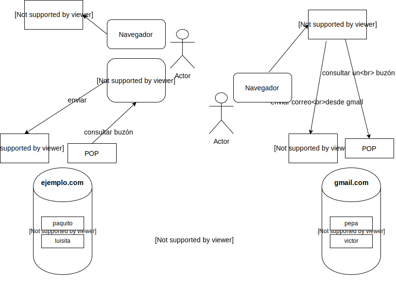

[TOC]
## Descripción
El correo electrónico, tan fácil de utilizar, se basa en procedimientos operativos complicados.
Es un sistema completamente independiente de la web, que solo comparte un punto: el nombre de dominio.

Se basa en **cuentas de correo** asociadas a un buzón. Para tener una dirección de correo, en algún sitio se crea el buzón, que es una base de datos de mensajes asociada a la dirección de correo.

La dirección de correo tiene dos partes: un identificador de usuario y la de la máquina donde se encuentra el buzón.
`paquito@ejemplo.com` --> *paquito* es el usuario, dentro del servidor *ejemplo.com*.

Intervienen tres elementos:
* El programa de correo: Es el que utiliza el usuario para consultar su buzón y enviar correos.
* El protocolo de consulta de correo, Normalmente POP3,. El programa de correo se comunica con este protocolo y le pide los correos almacenados para visualizarlos
* El protocolo de intercambio de correo, normalmente SMTP:  Cuando se redacta un correo nuevo, se entrega a este servidor que debe encargarse de enviarlo al buzón correspondiente

>>>> No suele ser buena idea instalar por nosotros mismos los servicios en nuestro VPS o Cloud.
>>>> Nos describen por qué en este artículo de _digitalocean_: [Why You May Not Want To Run Your Own Mail Server ](https://www.digitalocean.com/community/tutorials/why-you-may-not-want-to-run-your-own-mail-server).   
>>>> <small>¿No te ha convencido? Pues aquí puedes consultar un tutorial para instalar correo en Ubuntu, pero el proceso no es sencillo ni breve: [A Mailserver on Ubuntu 16.04: Postfix, Dovecot, MySQL](https://www.exratione.com/2016/05/a-mailserver-on-ubuntu-16-04-postfix-dovecot-mysql/) en ExRatione</small> 

.

>>>>>> Mucho más sensato contratarlo en una empresa de Cloud Computing: Ej: [Amazon WorkMail](https://aws.amazon.com/es/workmail/), [Correo Arsys](https://www.arsys.es/correo), [Correo OVH](https://www.ovh.es/emails/), productos de [email en aruba.it](https://hosting.aruba.it/es/email.aspx)  
>>>>>> Una vez contratados los buzones, habrá que modificar la zona DNS para incluir entradas MX que apunten a los servidores SMTP.
>>>>>> Los programas de correo los configuraremos con las credenciales del buzón (nombre y contraseña), y las direcciones o nombres de los servidores SMTP y POP3.

## Aplicaciones de correo
Tradicionalmente el correo se manejó a través de programas de escritorio instalados en el ordenador: [Microsoft Outlook](https://products.office.com/es-es/outlook/email-and-calendar-software-microsoft-outlook) o [Mozilla Thunderbird](https://www.thunderbird.net/es-ES/) han sido de los más populares. Los Smartphones y tablets suelen traer algún programa de correo genérico.
Estos programas se configuran con un servidor SMTP que envía correo y un servidor POP3 que permite consultar el buzón.

Desde hace bastantes años tenemos también clientes web, que no se instalan. Algunos están asociados a marcas comerciales, como [gmail](https://gmail.com) o [microsoft outlook live](https://outlook.live.com), que solo permiten acceder a buzones de sus sistemas.
Otros, sin embargo, son genéricos y se pueden adaptar a nuestros clientes e instalar en nuestro espacio web como aplicaciones comerciales. Ej: [RoundCube](https://roundcube.net/), [Horde Email Platform](https://www.horde.org/), [SquirrellMail](https://squirrelmail.org).

Los proveedores de Cloud Computing también suele proveer alguna aplicación web, ademas de acceso a los servicios SMTP, POP3 y alguna utilidad de administración de los buzones.  

## Protocolos
### SMTP 

* Significado: **Simple Mail Transfer Protocol**
* Nivel: aplicación
* Puerto: **25 TCP**
* Versión actual: Año 2008. Estándar IETF [RFC5321](https://tools.ietf.org/html/rfc5321)
* Versiónes iniciales de 1982 por Jon Postel, Eric Allman, Dave Crocker, Ned Freed, Randall Gellens, John Klensin, y Keith Moore. 

Cada nombre de dominio con correo tiene asociado un servidor SMTP, que es capaz de guardar mensajes en los buzones de su dominio.
El servidor acepta mensajes para enviar. Comprueba el destinatario del mensaje, y si es de su dominio, lo guarda en el buzón correspodiente.  
Si no es de su dominio, hace una consulta DNS, pero pregunta por la entrada MX del dominio, asociada al SMTP de dicho dominio. Entonces se comunica con el otro servidor SMTP y le envía el mensaje para que lo procese él.

### POP3

* Significado: **Postal Office Protocol v3**
* Nivel: aplicación
* Puerto: **110 TCP**
* Versión actual: Año 1996. Estándar IETF [RFC1939](https://tools.ietf.org/html/rfc1939)
* Versiónes iniciales de 1984 por M. Butler, J. Postel, D. Chase, J. Goldberger yJ. K. Reynolds.

Las aplicaciones de correo se comunican con este protocolo que es capaz de gestionar el buzón: leer los correos, borrarlos, etc.

### IMAP4.
Un sustituto poco utilizado de POP3. El protocolo POP3 es relativamente sencillo y presenta muchas dificultades técnicas. El IETF intentó sustituirlo por uno mucho mejor: IMAP4. Está implantado asociado a muchos buzones, sin embargo, no reemplaza a POP3. Se suele ofrecer como una opción adicional... es decir, allí donde se implanta, no se elimina POP3, porque este protocolo antiguo es ampliamente demandado.

Para saber mas:  
* [Internet Message Access Protocol](https://en.wikipedia.org/wiki/Internet_Message_Access_Protocol) en Wikipedia
* [IMAP y POP3: Diferencias, ventajas y desventajas](https://clouding.io/kb/imap-y-pop3-diferencias-ventajas-y-desventajas/) en clouding.io
