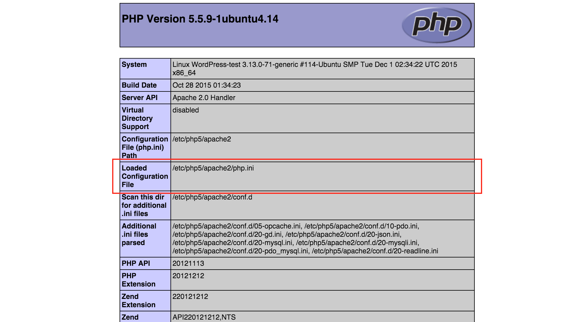

### Instalación
```
apt-get -y install php
```

Con esto se logra la instalación del intérprete *php* capaz de ejecutar scripts, pero no se integra con ningún servidor web. El intérprete viene como ejecutable directo y como librería embebible.
* `php <script>` ejecuta un script php
* `php -v` dice la versión
* `php -a` entra en el modo REPL interactivo
* `php -h` ayuda de la línea de comandos.

Php es un sistema modular. Para utilizar algunas características es necesario instalar sus módulos correspondientes.
Ej: de módulos habituales:
```
apt-get -y install php-mysql php-cgi php-curl php-json

```

Habitualmente, __apt-get__ no solo instala el paquete, sino que lo activa. No obstante, los comandos `phpenmod` y `phpdismod` activan y desactivan modulos. Esto también se puede hacer cambiando una propiedad `extension` en el fichero de configuración `php.ini`, que es lo que realmente hacen esos comandos.

Opciones para trabajar en la web:
* PHP tiene su propio servidor web. Se puede utilizar, pero no es tan rápido como apache u otros servidores ligeros.
* Instalación como CGI: poco ágil
* Instalación en el espacio de ejecución de apache como un módulo. Recomendado para desarrollo y configuraciones sin carga excesiva: `apt-get -y install libapache2-mod-php`
* Instalación como **fastCGI**: recurriendo a software de terceros, habitualmente. Recomendado para cargas de trabajo altas.

El fichero de configuración se llama `php.ini`. Es un fichero de directivas en formato *ini* de windows, pero su ubicación puede cambiar.  
Con la función `phpinfo()` podemos obtener información acerca de qué fichero de configuración se está utilizando.


>>> Phpinfo también indicará si php está en modo **cgi**, **módulo** o **fastcgi**.   
>>> En el apartado **Server API** si dice 'apache handler' está en modo módulo de apache.  
>>> En modo fastCGI mencionará directamente ese término y, probablemente,  el nombre de un producto de software.  
>>> El modo CGI es poco probable y poco recomendable.  

### php.ini
El fichero php.ini está completamente comentado, indicando el significado de las propiedades. Su estructura responde a un [fichero de configuracion 'ini' de windows](https://tldr.lanube.win/des/tema-3-configuraciones/lenguajes-de-marcas#ficheros-de-parmetros-ini...).

Algunas de las más comunes:
* `extension` carga un módulo. Ej: `extension=php_mbstring`
* `max_execution_time` fija el límite de tiempo que un script php puede ejecutarse. Ej: `max_execution_time = 30`
* `memory limit` fija la cantida de memoria que se proporciona a un script.
* `error_reporting` indica los errores de los que se informa.
* `display_errors` indica si los errores aparecen por la salida estándar, por la salida de error o no se muestran. Ej `display_errors = On`

