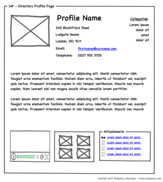

Un **wireframe** para un sitio web, también conocido como un esquema de página, plano de pantalla o **mock-up** (maqueta) es una guía visual
que representa el esqueleto o estructura visual de un sitio web. El wireframe esquematiza el diseño de página u ordenamiento del contenido
del sitio web, incluyendo elementos de la interfaz y sistemas de navegación, y cómo funcionan en conjunto.
Usualmente este esquema carece de estilo tipográfico, color o aplicaciones gráficas, ya que su principal objetivo reside en la funcionalidad,
comportamiento y jerarquía de contenidos. En otras palabras, se enfoca en “qué hace la pantalla, y no sólo no en cómo se ve.” Los esquemas pueden
ser dibujados con lápiz y papel o esquemas en una pizarra, o pueden ser producidos con medios de diseño de aplicaciones

El wireframe del sitio web conecta la estructura conceptual, o arquitectura de la información, con la superficie, o diseño visual del sitio web. Los wireframes ayudan a establecer funcionalidad, y las relaciones entre las diferentes plantillas de pantallas de un sitio web.

Si la aplicación va a tener diferentes vistas para diferentes dispositivos (ej: tablets, smartphones, etc) se diseñan wireframes para cada una.

Es conveniente involucrar al cliente en la confección de los wireframes, o al menos en su aprobación. Así, al ir haciendo entregas, el cliente ya sabe lo que va a ver, y siente el diseño como suyo.

## Diferencias entre UI y UX
La **experiencia de usuario (UX - User eXperience)** es una disciplina que estudia el conjunto de factores y elementos relativos a la interacción del usuario, con un entorno o dispositivo concretos, cuyo resultado es la generación de una percepción positiva o negativa de dicho servicio, producto o dispositivo. Ésta depende no solo de los factores relativos al diseño (hardware, software, usabilidad, diseño de interacción, accesibilidad, diseño gráfico y visual, calidad de los contenidos, buscabilidad o encontrabilidad, utilidad, etc) sino además de aspectos relativos a las emociones, sentimientos, construcción y transmisión de la marca, confiabilidad del producto, etc.

La experiencia de usuario como disciplina se aplica tradicionalmente a los sistemas informáticos y en particular al diseño de páginas web, pero hoy se ve ampliada a otros campos, ya que tomados como una «experiencia» casi cualquier producto o servicio, éstos comienzan a «diseñarse» buscando la máxima satisfacción del consumidor ahora visto como un «usuario» que transita tales experiencias. 

Por otro lado, el diseño de la **interfaz de usuario (UI - User Interface)** es una parte de la UX, en la que se diseña el esquema general de la interacción del usuario, y tiene ya una relación directa con las labores de diseño, tanto por el equipo informático como por el equipo artrístico de maquetación.

https://www.youtube.com/watch?v=lYWOzxVCTao

## Software

